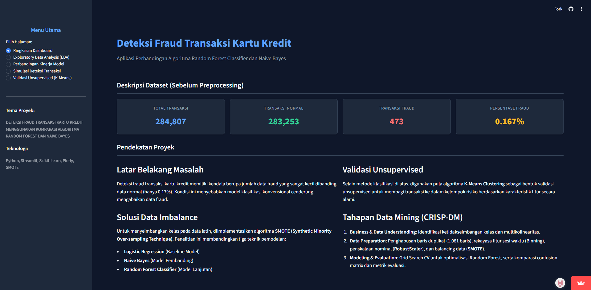
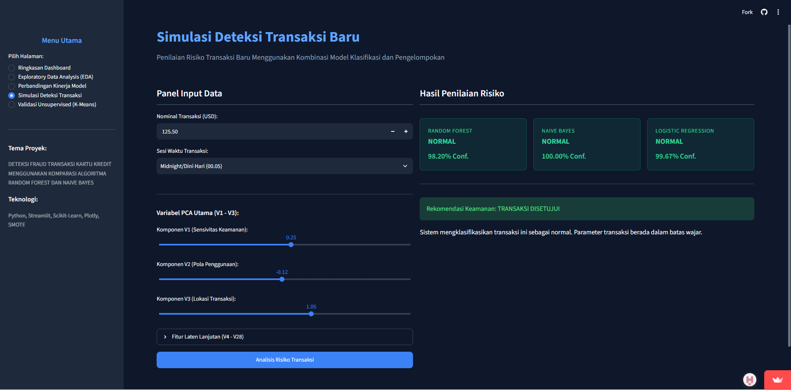

# TUGAS BESAR MATA KULIAH PENAMBANGAN DATA DETEKSI FRAUD TRANSAKSI KARTU KREDIT MENGGUNAKAN KOMPARASI ALGORITMA LOGISTIC REGRESSION, NAIVE BAYES, DAN RANDOM FOREST

| Dashboard Analisis & EDA | Dashboard Simulasi Deteksi Fraud |
| :---: | :---: |
|  |  |

**Deskripsi Proyek**

Proyek ini merupakan analisis eksploratif dan pemodelan machine learning terhadap dataset transaksi kartu kredit (~284.807 transaksi) untuk memprediksi dan mendeteksi transaksi fraud. Analisis ini menggunakan metodologi CRISP-DM dengan fokus utama menangani masalah ketidakseimbangan kelas (*class imbalance*) yang ekstrem di mana transaksi fraud hanya mencakup 0,172% dari total transaksi.

**Tujuan Analisis**

Mengevaluasi dan membandingkan performa tiga algoritma supervised learning (Logistic Regression, Naive Bayes, dan Random Forest Classifier) dalam mengklasifikasikan transaksi fraud setelah penerapan teknik SMOTE. Selain itu, proyek ini juga mengimplementasikan validasi kluster unsupervised menggunakan K-Means dan PCA 2D serta menyediakan aplikasi dashboard interaktif Streamlit untuk simulasi deteksi transaksi secara real-time.

**Proses Analisis**

Analisis dilakukan menggunakan Python dan framework Streamlit dalam format Jupyter Notebook (`TUBES DATMIN.ipynb`) serta aplikasi web (`app.py`). Tahapan utama meliputi:

1. Data Cleaning dan validasi ketersediaan data (menghapus 1.081 baris data duplikat).
2. Feature Engineering dan rekayasa sesi waktu transaksi (Midnight, Morning, Afternoon, Night) serta penskalaan variabel nominal menggunakan RobustScaler.
3. Penanganan ketidakseimbangan kelas (*class imbalance*) menggunakan teknik SMOTE (*Synthetic Minority Over-sampling Technique*) pada data pelatihan.
4. Eksplorasi Data (EDA) pola sebaran nominal transaksi, korelasi Pearson antar variabel PCA (V1-V28), dan perbandingan sesi waktu transaksi.
5. Pelatihan dan tuning hyperparameter model supervised (Logistic Regression sebagai baseline, Naive Bayes sebagai pembanding, dan Random Forest sebagai champion model).
6. Validasi pengelompokan alami tanpa label (*unsupervised clustering*) menggunakan algoritma K-Means (k=2) yang divisualisasikan dengan PCA 2D.
7. Rilis dan ekspor model terdistribusi ke dalam aplikasi dashboard interaktif Streamlit (`app.py`).

**Hasil Utama**

1. Random Forest Classifier terbukti menjadi model paling presisi (*champion model*) dengan tingkat akurasi pengujian 99,94%, Precision 87,65%, dan F1-Score 80,68%, yang secara signifikan paling sukses meminimalkan kesalahan deteksi *False Positive*.
2. Logistic Regression (Baseline) dan Naive Bayes menghasilkan Recall yang cukup tinggi (~81%-83%), namun memiliki tingkat Precision yang sangat rendah (<14%), sehingga berisiko tinggi memblokir transaksi valid nasabah secara keliru.
3. Hasil validasi unsupervised K-Means (k=2) membuktikan bahwa Kluster 1 terbentuk sebagai kluster *pure fraud* dengan tingkat kepadatan fraud sebesar 99,96% (67.782 sampel), mengonfirmasi bahwa karakteristik fitur transaksi fraud terpisah secara alami dari transaksi normal.
4. Rekayasa fitur sesi waktu menunjukkan bahwa rasio ancaman transaksi fraud cenderung meningkat pada transaksi yang dilakukan di luar jam kerja normal (sesi Midnight/Dini Hari).

**Rekomendasi Keamanan & Bisnis**

1. Pihak penyedia layanan keuangan disarankan untuk menerapkan Random Forest Classifier sebagai mesin deteksi utama guna menjaga keseimbangan antara keamanan transaksi dan kenyamanan nasabah.
2. Sistem otomatis perbankan perlu memberlakukan mekanisme Otentikasi Dua Faktor (2FA) atau verifikasi tambahan khusus untuk transaksi yang memiliki skor probabilitas risiko fraud tinggi pada sesi waktu dini hari.
3. Pembatasan nominal transaksi atau pengetatan ambang batas keamanan (threshold) perlu disesuaikan pada variabel laten utama (V1, V2, V3) yang memiliki tingkat variansi dan sensitivitas tertinggi terhadap indikasi fraud.
4. Penggunaan kombinasi pemodelan supervised dan validasi kluster unsupervised K-Means secara berkala disarankan untuk mendeteksi pola transaksi anomali jenis baru yang belum terlabeli pada database sistem.

**Tools dan Teknologi**

1. Python (pandas, numpy, scikit-learn, imbalanced-learn, joblib)
2. Streamlit Dashboard Framework (`app.py`)
3. Visualization Tools (plotly express, plotly graph_objects, seaborn, matplotlib)
4. Jupyter Notebook (`TUBES DATMIN.ipynb`)
